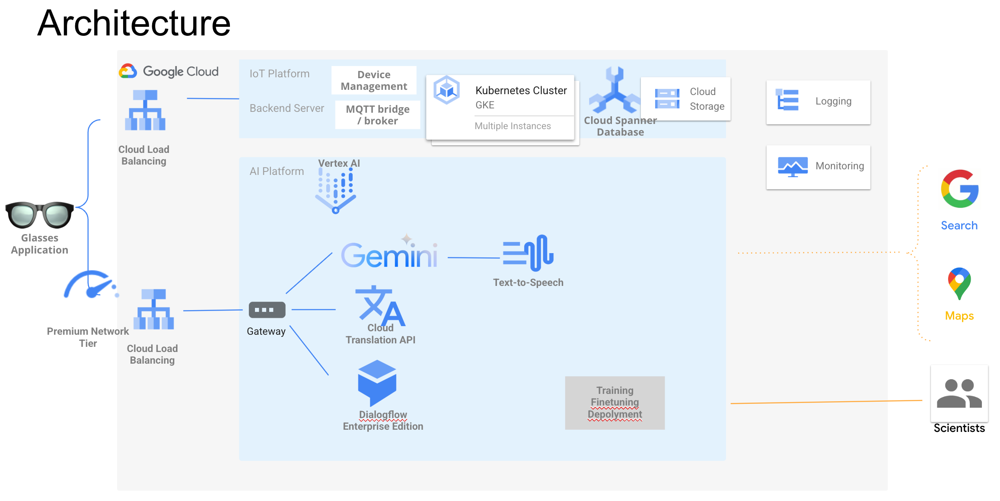
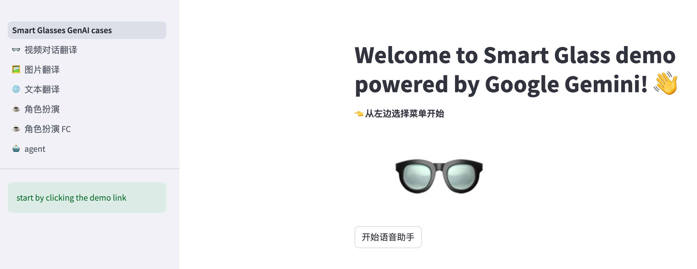

# Smart Glass Demo powered by Google Gemini 智能眼镜演示

## Architecture架构图

## setting 设置
* macOS:15.3
* chip: Apple M3 Pro
* Python: 3.12.2
* pip3 install -r requirements.txt
* pip3 install streamlit

## Running 运行
* python save_image.py
* python save_wav_vad.py
* streamlit run main.py
* 自动启动默认浏览器自动打开演示页面，如下图
  

## next action下一步
* Gemini 2.0 flash - live api
